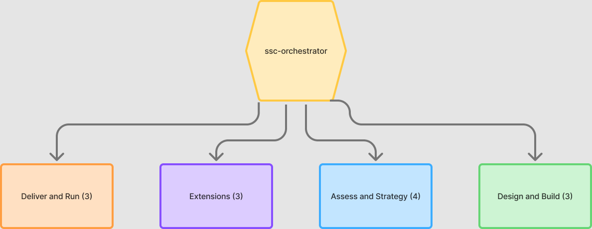

# 🏢 SSC/GBS Deployment Agent Suite — Costa Rica (English Edition)
## Based on Big 4 methodology | Updated with Big 4 Best Practices 2025–2026

---

## WHAT IS THIS?

A suite of **specialized agents (Claude skills)** designed to support the end-to-end deployment of a
**Shared Service Center (SSC) or Global Business Services (GBS)** organization in Costa Rica.

Each `.skill` file is an installable agent. The orchestrator coordinates the full pipeline; the
remaining skills are stage specialists. This is the English edition; the Spanish edition lives in
`../es/`.

---

## SKILLS IN THIS EDITION (14)

| Skill | Module | Use when you need to… |
|-------|--------|------------------------|
| `ssc-orchestrator-en` | Orchestrator | Know where to start / coordinate the whole pipeline |
| `ssc-diagnostic-en` | M01 Diagnostic | Assess Finance maturity, run an FRA, score SSC suitability |
| `ssc-strategy-en` | M02 Strategy | Decide SSC vs GBS vs BPO, design the operating model |
| `ssc-location-cr-en` | M03 Location | Analyze Costa Rica, Free Zones, talent, costs |
| `ssc-business-case-en` | M04 Business Case | Build the financial model, ROI/NPV/payback |
| `ssc-process-automation-en` | M05 Process & Automation | Redesign P2P/O2C/R2R, RPA/IDP/GenAI |
| `ssc-technology-en` | M06 Technology | Select ERP, design the digital stack |
| `ssc-org-talent-en` | M07 Org & Talent | Org chart, salary bands, change management |
| `ssc-migration-kt-en` | M08 Migration & KT | Wave plan, knowledge transfer, go-live |
| `ssc-service-mgmt-en` | M09 Service Mgmt | SLAs, KPIs, governance, chargeback, VoC |
| `ssc-sustain-ci-en` | M10 Sustain & CI | Health check, Kaizen, OKRs, BCP |
| `ssc-hr-gbs-en` | M11 HR GBS | Multi-country payroll, benefits, HR self-service |
| `ssc-esg-hub-en` | M12 ESG Hub | CSRD/ESRS, double materiality, Scope 1/2/3 |
| `ssc-ma-support-en` | M13 M&A Support | Due diligence, PMI, carve-outs from the GBS |

---

## ARCHITECTURE — UNIFIED TOOLKIT

A single toolkit: the **orchestrator** coordinates 14 skills organized into 4 capability
areas (not a phase pipeline). Each skill is detailed in the tables below.

> Vector version: [docs/architecture.svg](../docs/architecture.svg) · Editable in FigJam: [open](https://www.figma.com/board/TMV2vXlDj8R3jjhCb1pTna)

---

## ADAPTATION NOTES (vs. Spanish edition)

- Not a literal translation: business-English GBS terminology (APQC / The Hackett Group standards).
- Costa Rica market data (salaries, Free Zone numbers) is preserved unchanged.
- Benchmarks framed against **global** datasets, not LATAM-only.
- US GAAP context added alongside IFRS where relevant for North American audiences.
- Big 4 references kept, with emphasis on global practices.

---

## COMPANION TOOLS

- `../templates/SSC_Business_Case_Template.xlsx` — 9-sheet financial model (live formulas: NPV/IRR/Payback)
- `../templates/SSC_KPI_Dashboard_Template.xlsx` — 8-sheet KPI dashboard with RAG status
- `../scripts/update_cr_data.py` — refreshes Costa Rica market data from CINDE/PROCOMER

---

## SOURCES & METHODOLOGY

- SSC/GBS toolkit (prácticas Big 4) (SSC01–39, FNT03–38), Finance Rapid Assessment methodology
- Big 4 updates 2024–2026: Deloitte (GBS evolution, Intelligent Automation), PwC (Touchless,
  Cloud ERP first, ESG Hub), KPMG (Zero-Touch, Connected Finance, BCP)
- Market data: CINDE, PROCOMER, APQC, Gartner, The Hackett Group
- CSRD/ESRS: post-Omnibus I (EU Official Journal, 26 Feb 2026)

*Created: June 2026 | Version 1.0 | Refresh annually with new Big 4 benchmarks*
